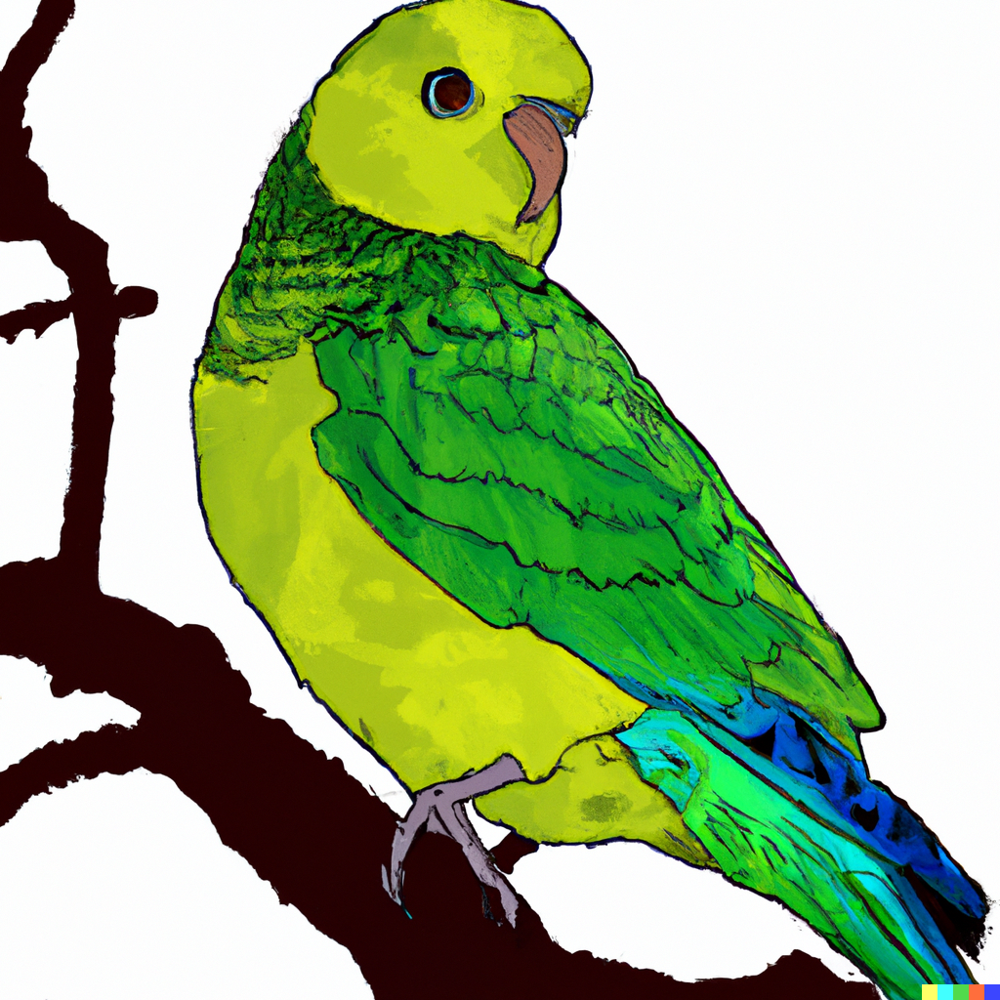

# Parakeet
A paraphraser is a tool that is used to rewrite a piece of text in order to make it easier to understand. The tool is based on the Seq2Seq model, which is a neural network that is used to learn the structure of a text. The Seq2Seq model is trained on a large dataset of texts, and the paraphraser is able to use this information to generate a new piece of text that is easier to understand.



## What is the need of a paraphraser?
A paraphraser is a tool that is used to rephrase or rewrite a piece of text. This is often done in order to improve the clarity of the original text, or to make it more concise.
There are many reasons why someone might need to use a paraphraser. For example, if someone is writing an essay and wants to include a quote from a book, they might need to paraphrase the quote to make it fit into their essay. Or, if someone is giving a speech and wants to make sure they are not plagiarizing, they might need to paraphrase their sources.
Additionally, a paraphraser can be used to simplify complex language, make an argument more convincing, or to clarify the meaning of something.

## What is a good paraphraser tool?
A good paraphraser can be considered good which offers maximum diversity from the original phrase but minimum change of meaning. So technially a tool which can offer minimum syntactic similarity and maximum semantic similarity can rightfully be called a good paraphrasing tool.
Additionally another metric which helps understand the performance is Fluency which will state the fluency of the output.
As also mentioned in [Parrot](https://github.com/PrithivirajDamodaran/Parrot_Paraphraser) these are the best metrics to evaluate the paraphaser for it's performance.
## Metrics
1) **Adequacy** (How much is the output phrase similar to the input phrase in it's meaning)
2) **Diversity** (How much is the sentence different from the input sentence in terms of syntax)
3) **Fluency** (How much a phrase is fluent in terms of linguistics)

## So how does a human do paraphrasing?
When paraphrasing, humans take the original text and restate it in their own words. A human might use several techniques such as joining sentences, placing subject before/after which is dependent on input, using portmanteau words (blending two words or part of words for schmick setting).
Changing order of sentence such that the meaning remains same but syntactically it becomes different. 
These are some ways human does text rewriting/paraphrasing

## Can a machine do paraphrasing?
The answer is simply YYEsSS, it can. There are two approaches to make a machine be able to do paraphrasing.
1. **Heuristic Engine** Build A heuristic engine which can annotate words for their parts of speech, replace words with their synonyms but in the same tense, join sentences by using conjunction words and more. 
2. Seq2Seq Machine Translation Model: Gather sufficient input output pairs of paraphrased input and fine-tune a Seq2Seq model for the task.

Challenges of creating **Heuristic Engine** is it becomes more of a linguistic expert task and it is very difficult to get better paraphrasing in this method due to limitation of vocabulary as well
Whereas the most prominent challenge in Seq2Seq Model is before fine-tuning you would have to get a good dataset and to judge it you'll have to establish a baseline using the metrics in order to train a model which would be optimised on the metrics.

## What's different than other tools?
The mostly well-known open-source paraphrasing tool which is [Parrot,](https://github.com/PrithivirajDamodaran/Parrot_Paraphraser) offered a good accuracy but it was first hand trained on open-source datasets which are not that good source of paraphrasing data. One can easily validate using the above 3 metrics in which diversity and adequacy metric will be not at all bearable. 
1. MSRPC
2. Quora QNA Pairs
3. Google PAWS
In this model the dataset being used to train is human created data which offers good creativity and metric scores.
Also Parrot is trained on T5 which is quite heavy model and when compared to current model (BART), was very slow on the same system whereas Parakeet was faster and that also makes it apt for batch data augmentation.

## Installation
```python
pip install git+https://github.com/leetanshaj/Parakeet_Paraphraser.git -U
```

## Quick Start
```python
sequences = [
    "In addition, I will provide some portable original functions which you can use in any other NLP projects for preprocessing.",
    "Just collect them for free and share them on social media with the #NationalCoffeeDay",
    "Baseball is one of the most popular sports in the world, and for good reason.",
    "Every year, National Coffee Day will be celebrated on September 29 in the United States and International Coffee Day will be celebrated on October 1.",
    "Keeping your dog safe is very important for us.",
    "In fact, it wouldn’t be wrong to claim that the success and failure of your campaigns hinge on the email marketing software you choose to employ.",
    "Make text lighthearted by putting yourself in your customer’s shoes."
]
for sequence in sequences:
    print("_"*50)
    print(f"Input Sequence: {sequence}")
    result = Parakeet.rephrase(sequence, max_length = 256, top_k = 50, top_p = 0.80)
    for index,(i,j) in enumerate(result.items()):
        print(f"\tOutput Sequence {index}: {i}")
        print(f"\tAdequacy: {j['adequacy']}")
        print(f"\tDiversity: {j['diversity']}")
    print()
    print("#"*50)
    print()
```

```
Input Sequence: In addition, I will provide some portable original functions which you can use in any other NLP projects for preprocessing.
	Output Sequence 0: In addition, I'll provide some preprocessing-optimized portable original functions that can be used in any other NLP project.
	Adequacy: 0.9523109197616577
	Diversity: 54.0
	Output Sequence 1: In addition, I'll provide some portable original functions for preprocessing that can be used in any other NLP project.
	Adequacy: 0.9789776802062988
	Diversity: 63.0
	Output Sequence 2: In addition, I'll provide some portable original functions that can be used in any other NLP project that needs preprocessing.
	Adequacy: 0.976693868637085
	Diversity: 81.0

##################################################

__________________________________________________
Input Sequence: Just collect them for free and share them on social media with the #NationalCoffeeDay hashtag
	Output Sequence 0: Just collect them for free and share them on social media with the hashtag #NationalCoffeeDay.
	Adequacy: 0.9925521612167358
	Diversity: 82.0
	Output Sequence 1: Just collect them for free and share them with the hashtag #NationalCoffeeDay on social media.
	Adequacy: 0.9919487237930298
	Diversity: 63.0
	Output Sequence 2: Just collect them for free and share them on social media using the hashtag #NationalCoffeeDay.
	Adequacy: 0.9924598932266235
	Diversity: 78.0

##################################################

__________________________________________________
Input Sequence: Baseball is one of the most popular sports in the world, and for good reason.
	Output Sequence 0: Baseball is one of the most popular sports in the world, and for good reason.
	Adequacy: 1.000000238418579
	Diversity: 100.0
	Output Sequence 1: Baseball is one of the most widely played sports in the world, and for good reason.
	Adequacy: 0.9828927516937256
	Diversity: 87.0
	Output Sequence 2: Baseball is one of the world's most popular sports, and for good reason.
	Adequacy: 0.9941436052322388
	Diversity: 73.0

##################################################

__________________________________________________
Input Sequence: Every year, National Coffee Day will be celebrated on September 29 in the United States and International Coffee Day will be celebrated on October 1.
	Output Sequence 0: National Coffee Day will be celebrated in the United States on September 29 every year, while International Coffee Day is celebrated on October 1.
	Adequacy: 0.991370439529419
	Diversity: 60.0
	Output Sequence 1: National Coffee Day will be celebrated in the United States on September 29, while International Coffee Day is celebrated on October 1.
	Adequacy: 0.986881673336029
	Diversity: 64.0
	Output Sequence 2: National Coffee Day will be celebrated in the United States on September 29, and International Coffee Day would be celebrated on October 1.
	Adequacy: 0.9879142642021179
	Diversity: 70.0

##################################################

__________________________________________________
Input Sequence: Keeping your dog safe is very important for us.
	Output Sequence 0: We are very concerned about keeping your dog safe.
	Adequacy: 0.8645513653755188
	Diversity: 20.0
	Output Sequence 1: We are so concerned about keeping your dog safe.
	Adequacy: 0.8711440563201904
	Diversity: 19.0
	Output Sequence 2: We are incredibly concerned about keeping your dog safe.
	Adequacy: 0.8656008839607239
	Diversity: 23.0

##################################################

__________________________________________________
Input Sequence: In fact, it wouldn’t be wrong to claim that the success and failure of your campaigns hinge on the email marketing software you choose to employ.
	Output Sequence 0: In fact, the success and failure of your campaigns are dependent on the email marketing software you choose to employ.
	Adequacy: 0.8885285258293152
	Diversity: 68.0
	Output Sequence 1: In fact, the success and failure of your campaigns is dependent on the email marketing software you choose to employ.
	Adequacy: 0.8891788721084595
	Diversity: 69.0
	Output Sequence 2: In fact, the success and failure of your campaigns are all dependent on the email marketing software you choose to employ.
	Adequacy: 0.8809630870819092
	Diversity: 66.0

##################################################

__________________________________________________
Input Sequence: Make text lighthearted by putting yourself in your customer’s shoes.
	Output Sequence 0: By putting yourself in your customer's shoes, you can make text lighthearted.
	Adequacy: 0.9514826536178589
	Diversity: 27.0
	Output Sequence 1: By putting yourself in your customer's shoes, make text lighthearted.
	Adequacy: 0.9604176878929138
	Diversity: 30.0
	Output Sequence 2: By putting yourself in your customers' shoes, you can make text lighthearted.
	Adequacy: 0.9443089962005615
	Diversity: 26.0

##################################################
```
## Adequacy & Diversity
**Adeuqacy** : The scores for Adequacy ranges from 0.0 to 1 and shows the semantic similarity between input and output. (The higher the better)

**Diversity** : The score for Diversity ranges from 0 to 100 which is normalised and shows the syntactic similarity between input and output. (The lower the better)

**You can turn off Adequacy and Diversity scores by using**
```python return_diversity_score=False, return_similarity_score=False```


## References
[BART](https://arxiv.org/pdf/1910.13461.pdf): Denoising Sequence-to-Sequence Pre-training for Natural Language Generation, Translation, and Comprehension 

[CoRPG](https://github.com/L-Zhe/CoRPG): Document-Level Paraphrase Generation with Sentence Rewriting and Reordering

[Parrot](https://github.com/PrithivirajDamodaran/Parrot_Paraphraser): Parrot Paraphraser on T5

## Contact
Anshaj Goyal
* [LinkedIn](https://www.linkedin.com/in/anshaj-goyal/)
* [Medium](https://anshaj-goyal.medium.com/)
* [HuggingFace](https://huggingface.co/anshajgoyal)

## Citation

To cite Parakeet-Paraphraser in your work, please use the following bibtex reference:

```bibtex
@misc{anshajgoyalParakeet,
  author       = {Anshaj Goyal},
  title        = {Parakeet: Paraphraser for Text Augmentation},
  year         = 2022,
  version      = {v1.0}
}
```